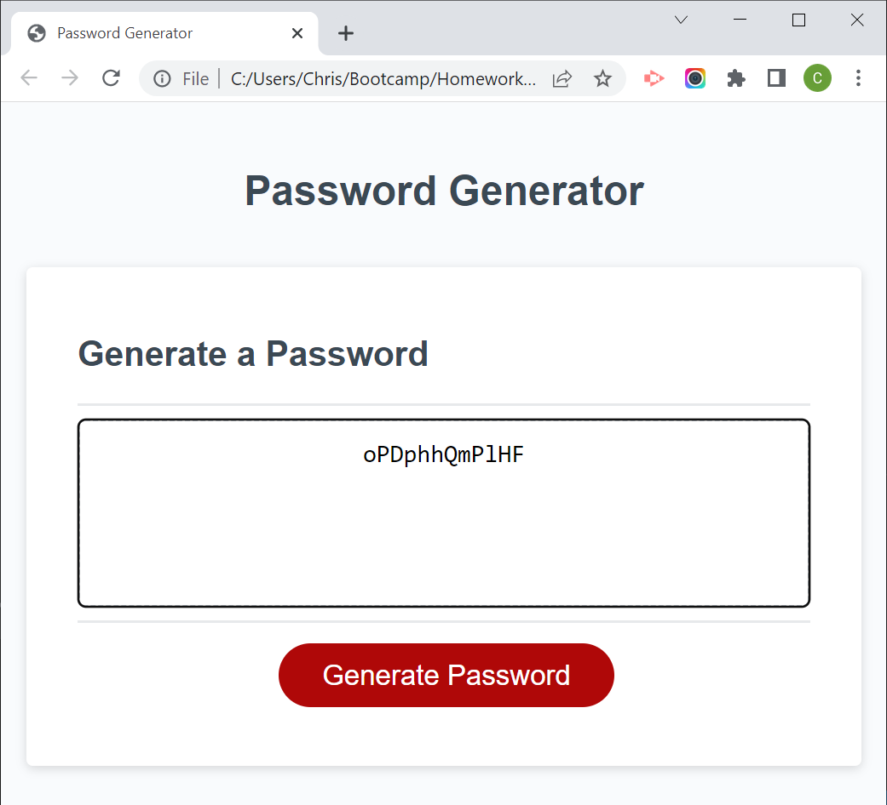

# Password Generator (03-JavaScript Challenge)

[Live Site on Github.io](https://cokamuro.github.io/passwordgenerator/)

## Table of Contents
- [Description](#description)
- [Visuals](#visuals)
- [Usage](#usage)

## Description
This is the solution HTML and JavaScript for the 02-Challenge assignment in the 03-JavaScript Module.

The purpose of the assignment was to create password generator that followed user-selected generation rules.

The generator queries password length, if the password is to include lowercase, uppercase, numerics, and special characters.  It then generates a password of the specified length with a roughly equal distribution of the character types allowed.

## Visuals
### The site in operation

## Usage
This project is complete and should have no future revisions    
